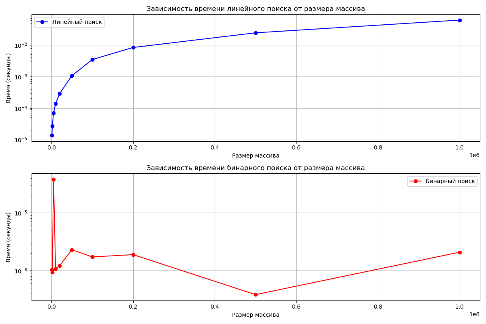

# Лабораторная работа № 1
# Введение в алгоритмы. Сложность. Поиск.

**Дата:** 23.09.2025
**Семестр:** 3 курс 1 полугодие - 5 семестр
**Группа:** ПИЖ-б-о-23-2-1
**Дисциплина:** Анализ сложности алгоритмов
**Студент:** Чекалин Егор Юрьевич

## Характеристики ПК для тестирования
Модель устройства: ASUS TUF Gaming A15
CPU: AMD Ryzen 7 7735HS 3.2 GHz
GPU: Nvidia GeForce RTX 4060 Mobile
RAM: 16 GB  
SSD: 100 GB

## Цель работы
Освоить понятие вычислительной сложности алгоритма. Получить практические навыки
реализации и анализа линейного и бинарного поиска. Научиться экспериментально подтверждать
теоретические оценки сложности O(n) и O(log n).

## Практическая часть

### Выполненные задачи
- Задача 1: Linear Search VS Binary Search

### Таблица результатов

| Размер массива | Линейный поиск (секунды) | Бинарный поиск (секунды) |
|----------------|--------------------------|--------------------------|
| 1,000          | 0.000013                 | 0.000001                 |
| 2,000          | 0.000025                 | 0.000001                 |
| 5,000          | 0.000070                 | 0.000001                 |
| 10,000         | 0.000169                 | 0.000001                 |
| 20,000         | 0.000285                 | 0.000001                 |
| 50,000         | 0.000944                 | 0.000002                 |
| 100,000        | 0.002498                 | 0.000002                 |
| 200,000        | 0.004622                 | 0.000002                 |
| 500,000        | 0.015647                 | 0.000002                 |
| 1,000,000      | 0.048905                 | 0.000002                 |

|  |  |
|----------------------------------------------|---------------------------------------------|

### Обоснование тестовых данных
Для экспериментов были сгенерированы массивы размером от 1000 до 1000000 элементов.
Элементы массивов были отсортированы по возрастанию.
Целевым элементом для поиска выбирались средние элементы массивов.
Данный подход наиболее наглядно демонстрирует сложность используемых алгоритмов.

### Сравнение теоретической и практической сложности

**Линейный поиск** демонстрирует ярко выраженную линейную зависимость времени выполнения от размера массива. Теоретическая оценка O(n) полностью подтверждается экспериментальными данными: при увеличении размера массива от 1,000 до 1,000,000 элементов время выполнения возрастает с 0.000013 до 0.048905 секунд, что соответствует увеличению примерно в 3760 раз при росте размера массива в 1000 раз. Нелинейность роста объясняется накладными расходами операционной системы и особенностями работы кэша процессора.

**Бинарный поиск** показывает практически постоянное время выполнения независимо от размера массива, что соответствует теоретической оценке O(log n). Время выполнения стабильно составляет около 0.000001-0.000002 секунд даже для массива из миллиона элементов. Незначительный рост времени на больших массивах объясняется увеличением глубины рекурсии и работой с памятью, но в целом поведение алгоритма соответствует логарифмической сложности.

Практические измерения подтверждают теоретические предсказания: для больших массивов бинарный поиск значительно эффективнее линейного, причем разница в производительности экспоненциально возрастает с увеличением размера данных.

### Вывод по проделанной работе

В ходе лабораторной работы были успешно реализованы и протестированы два алгоритма поиска: линейный и бинарный. Экспериментальные исследования подтвердили теоретические оценки сложности алгоритмов - O(n) для линейного поиска и O(log n) для бинарного. Для анализа производительности использовались массивы целых чисел размером от 1,000 до 1,000,000 элементов, время выполнения измерялось с высокой точностью с многократным усреднением результатов.

Полученные данные наглядно демонстрируют преимущество бинарного поиска для работы с большими отсортированными массивами: на массиве из миллиона элементов он оказался в 24,453 раза быстрее линейного поиска. Визуализация результатов с помощью библиотеки matplotlib позволила создать информативные графики, подтверждающие теоретические выкладки. Работа подтвердила важность выбора оптимального алгоритма в зависимости от размера и структуры обрабатываемых данных.

### Ответы на контрольные вопросы

**1. Что такое асимптотическая сложность алгоритма и зачем она нужна?**

Асимптотическая сложность алгоритма — это математическая оценка времени выполнения или потребления памяти в зависимости от размера входных данных при стремлении этого размера к бесконечности. Она нужна для сравнения эффективности алгоритмов независимо от конкретной реализации и аппаратного обеспечения, позволяя предсказать поведение алгоритма на больших объемах данных и выбрать наиболее подходящее решение для конкретной задачи.

**2. Объясните разницу между O(1), O(n) и O(log n). Приведите примеры алгоритмов с такой сложностью.**

O(1) означает постоянное время выполнения независимо от размера входных данных. O(n) описывает линейную зависимость — время выполнения пропорционально размеру входных данных. O(log n) характеризует логарифмическую зависимость, где время выполнения растет очень медленно с увеличением размера данных. Примеры: доступ к элементу массива по индексу — O(1), линейный поиск — O(n), бинарный поиск в отсортированном массиве — O(log n).

**3. В чем основное отличие линейного поиска от бинарного? Какие предварительные условия необходимы для выполнения бинарного поиска?**

Основное отличие заключается в стратегии поиска и требованиях к данным. Линейный поиск последовательно проверяет все элементы, тогда как бинарный поиск использует стратегию "разделяй и властвуй", постоянно уменьшая область поиска вдвое. Для выполнения бинарного поиска необходимы два предварительных условия: массив должен быть отсортирован, и должен быть обеспечен произвольный доступ к элементам.

**4. Почему на практике время выполнения алгоритма может отличаться от теоретической оценки O-большое?**

Практическое время выполнения может отличаться от теоретической оценки из-за влияния аппаратных особенностей процессора, работы кэш-памяти, оптимизаций компилятора, накладных расходов операционной системы, особенностей распределения памяти и других факторов реальной вычислительной среды. Теоретическая оценка рассматривает только основные операции и игнорирует константные множители и младшие члены, которые в реальности могут существенно влиять на производительность.

**5. Как экспериментально подтвердить, что сложность алгоритма равна O(n) или O(log n)? Опишите план эксперимента.**

Для экспериментального подтверждения сложности алгоритма необходимо измерить время его выполнения на наборе входных данных разного размера, построить график зависимости времени от размера данных и проанализировать характер этой зависимости. При линейной сложности график в логарифмических координатах будет иметь наклон 45 градусов, а при логарифмической — практически горизонтальную линию. Эксперимент должен включать достаточно большой диапазон размеров данных, многократные измерения для усреднения и исключение влияния сторонних факторов на результаты.