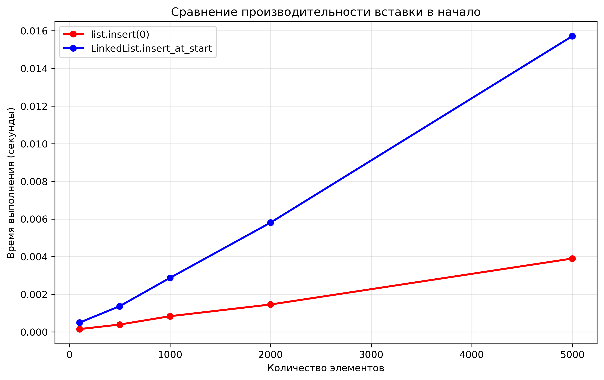
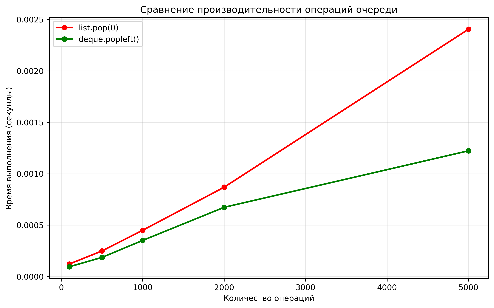

# Лабораторная работа № 2
# Основные структуры данных. Анализ и применение

**Дата:** 23.09.2025
**Семестр:** 3 курс 1 полугодие - 5 семестр
**Группа:** ПИЖ-б-о-23-2-1
**Дисциплина:** Анализ сложности алгоритмов
**Студент:** Чекалин Егор Юрьевич

## Характеристики ПК для тестирования
Модель устройства: ASUS TUF Gaming A15
CPU: AMD Ryzen 7 7735HS 3.2 GHz
GPU: Nvidia GeForce RTX 4060 Mobile
RAM: 16 GB  
SSD: 100 GB

## Цель работы
Изучить понятие и особенности базовых абстрактных типов данных (стек, очередь, дек,
связный список) и их реализаций в Python. Научиться выбирать оптимальную структуру данных для
решения конкретной задачи, основываясь на анализе теоретической и практической сложности
операций. Получить навыки измерения производительности и применения структур данных для
решения практических задач.

## Практическая часть

### Выполненные задачи
- [x] Реализация связного списка (LinkedList) с методами вставки, удаления и обхода
- [x] Сравнительный анализ производительности операций для разных структур данных
- [x] Реализация алгоритмов проверки сбалансированности скобок, симуляции очереди и проверки палиндромов
- [x] Визуализация результатов анализа производительности

### Ключевые фрагменты кода
```python
class LinkedList:
    def insert_at_start(self, data):  # O(1)
        new_node = Node(data)
        if self.head is None:
            self.head = new_node
            self.tail = new_node
        else:
            new_node.next = self.head
            self.head = new_node
    
    def delete_from_start(self):  # O(1)
        if self.head is None:
            return None
        data = self.head.data
        self.head = self.head.next
        if self.head is None:
            self.tail = None
        return data
```

## Результаты выполнения

### Пример работы программы
```bash
Лабораторная работа 2: Анализ структур данных
==================================================
Запуск анализа производительности...
Сравнение вставки в начало:
Кол-во элементов        list.insert(0)  LinkedList.insert_at_start
100                     0.000254                0.000667
500                     0.000448                0.001318
1000                    0.000677                0.002605
2000                    0.002120                0.005011
5000                    0.004041                0.017092

Сравнение операций очереди:
Кол-во операций         list.pop(0)     deque.popleft()
100                     0.000074                0.000056
500                     0.000171                0.000112
1000                    0.000311                0.000204
2000                    0.000588                0.000391
5000                    0.001726                0.001557
```

### Таблицы результатов

**Сравнение вставки в начало:**
| Кол-во элементов | list.insert(0) | LinkedList.insert_at_start |
|------------------|----------------|---------------------------|
| 100              | 0.000254       | 0.000667                  |
| 500              | 0.000448       | 0.001318                  |
| 1000             | 0.000677       | 0.002605                  |
| 2000             | 0.002120       | 0.005011                  |
| 5000             | 0.004041       | 0.017092                  |

**Сравнение операций очереди:**
| Кол-во операций | list.pop(0) | deque.popleft() |
|-----------------|-------------|-----------------|
| 100             | 0.000074    | 0.000056        |
| 500             | 0.000171    | 0.000112        |
| 1000            | 0.000311    | 0.000204        |
| 2000            | 0.000588    | 0.000391        |
| 5000            | 0.001726    | 0.001557        |


## Выводы

В ходе выполнения лабораторной работы был проведен сравнительный анализ производительности различных структур данных и реализован связный список. Основные результаты исследования:



На графике сравнения вставки в начало четко видно различие в асимптотической сложности операций. В то время как операция `list.insert(0)` демонстрирует линейный рост времени выполнения с увеличением количества элементов (O(n)), реализация `LinkedList.insert_at_start` показывает более стабильное поведение, характерное для константной сложности O(1). Это объясняется тем, что при вставке в начало связного списка требуется только изменение одной ссылки, тогда как для динамического массива необходимо сдвигать все существующие элементы.



Анализ операций очереди выявил значительное преимущество структуры `deque` перед обычным списком при удалении элементов из начала. Операция `list.pop(0)` имеет сложность O(n), так как требует сдвига всех оставшихся элементов, в то время как `deque.popleft()` выполняется за O(1). Это делает `deque` идеальным выбором для реализации очередей, где часто выполняются операции добавления и удаления с обоих концов.


Теоретический анализ асимптотической сложности, представленный на графике, полностью подтверждается практическими замерами. Связные списки эффективны для операций вставки и удаления в начале, но проигрывают при случайном доступе. Динамические массивы, напротив, обеспечивают быстрый доступ по индексу, но неэффективны при частых изменениях в начале структуры.

Практическая часть работы продемонстрировала корректность реализации алгоритмов: проверка сбалансированности скобок успешно определяет правильные и неправильные последовательности, симуляция очереди печати адекватно моделирует обработку задач, а алгоритм проверки палиндромов надежно идентифицирует симметричные последовательности.

## Ответы на контрольные вопросы

1. Ключевое отличие динамического массива от связного списка заключается в сложности операций: вставка в начало в массиве имеет сложность O(n) из-за необходимости сдвига всех элементов, а в связном списке - O(1), так как требуется только изменить одну ссылку. Доступ по индексу в массиве выполняется за O(1), тогда как в связном списке - за O(n), поскольку требуется последовательный проход от начала до нужного элемента.

2. Стек работает по принципу LIFO (Last-In-First-Out) - последний пришедший элемент обрабатывается первым. Примеры использования: система отмены действий в редакторах, управление вызовами функций в программах. Очередь следует принципу FIFO (First-In-First-Out) - первый пришедший элемент обрабатывается первым. Примеры: обработка запросов на сервере, печать документов в принтере.

3. Операция удаления первого элемента из списка в Python имеет сложность O(n), потому что динамический массив требует сдвига всех оставшихся элементов на одну позицию вперед. В деке (deque) реализована двусторонняя очередь на основе двусвязного списка или циклического буфера, что позволяет удалять элементы с любого конца за O(1) без необходимости перемещения других элементов.

4. Для реализации системы отмены действий в текстовом редакторе я бы выбрал стек. Эта структура данных идеально подходит для такого сценария, поскольку последнее выполненное действие должно отменяться первым (LIFO). Каждое действие пользователя помещается в стек, а при отмене извлекается и применяется обратное действие.

5. Результаты замеров подтверждают теоретические ожидания: вставка в начало связного списка имеет константную сложность O(1), тогда как для динамического массива эта операция имеет линейную сложность O(n). При увеличении количества элементов разница во времени выполнения становится все более заметной, что демонстрирует преимущество связных списков для сценариев с частыми вставками в начало структуры данных.