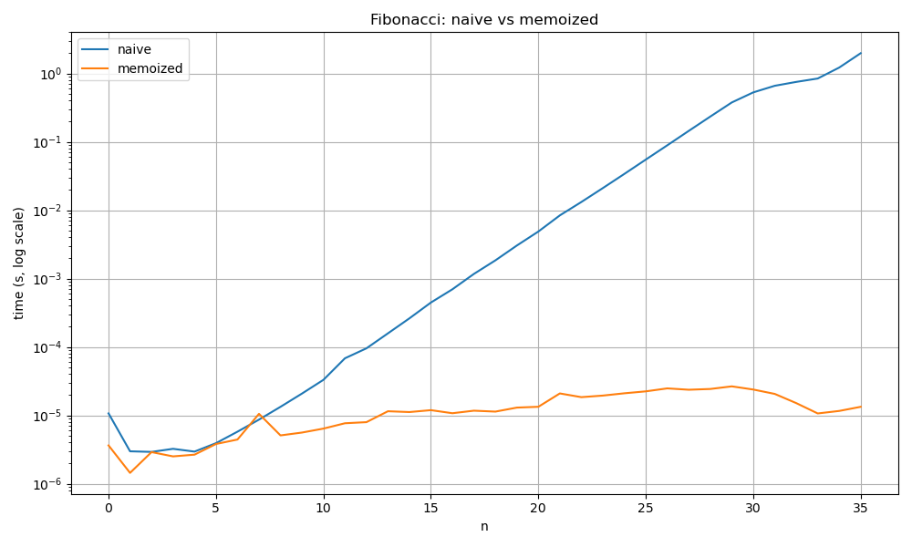

# Лабораторная работа № 3
# Рекурсия

**Дата:** 23.09.2025
**Семестр:** 3 курс 1 полугодие - 5 семестр
**Группа:** ПИЖ-б-о-23-2-1
**Дисциплина:** Анализ сложности алгоритмов
**Студент:** Чекалин Егор Юрьевич

## Характеристики ПК для тестирования
Модель устройства: ASUS TUF Gaming A15
CPU: AMD Ryzen 7 7735HS 3.2 GHz
GPU: Nvidia GeForce RTX 4060 Mobile
RAM: 16 GB  
SSD: 100 GB

## Цель работы
Освоить принцип рекурсии, научиться анализировать рекурсивные алгоритмы и
понимать механизм работы стека вызовов. Изучить типичные задачи, решаемые рекурсивно, и освоить
технику мемоизации для оптимизации рекурсивных алгоритмов. Получить практические навыки
реализации и отладки рекурсивных функций.

## Практическая часть

### Выполненные задачи

* [x] Задача 1: Реализованы классические рекурсивные алгоритмы (факториал, числа Фибоначчи, быстрое возведение в степень).
* [x] Задача 2: Выполнен анализ временной сложности и глубины рекурсии для реализованных функций.
* [x] Задача 3: Реализована оптимизация рекурсивных алгоритмов с помощью мемоизации и проведено сравнение производительности.
* [x] Задача 4: Решены прикладные задачи: рекурсивный бинарный поиск, обход файловой системы и задача «Ханойские башни».
* [x] Задача 5: Выполнено экспериментальное исследование времени вычислений и глубины рекурсии.

## Результаты выполнения

```bash
Сравнение для n=35 (наивная и мемоизированная)...
n = 35
Наивная: value=9227465, time=6.732s, calls=29860703
Мемоизация: value=9227465, time=0.000040s, calls=69

n=0: naive_time=0.000011s memo_time=0.000004s
n=1: naive_time=0.000003s memo_time=0.000001s
n=2: naive_time=0.000003s memo_time=0.000003s
n=3: naive_time=0.000003s memo_time=0.000003s
n=4: naive_time=0.000003s memo_time=0.000003s
n=5: naive_time=0.000004s memo_time=0.000004s
n=6: naive_time=0.000006s memo_time=0.000004s
n=7: naive_time=0.000009s memo_time=0.000011s
n=8: naive_time=0.000013s memo_time=0.000005s
n=9: naive_time=0.000021s memo_time=0.000006s
n=10: naive_time=0.000033s memo_time=0.000006s
n=11: naive_time=0.000068s memo_time=0.000008s
n=12: naive_time=0.000096s memo_time=0.000008s
n=13: naive_time=0.000158s memo_time=0.000012s
n=14: naive_time=0.000263s memo_time=0.000011s
n=15: naive_time=0.000447s memo_time=0.000012s
n=16: naive_time=0.000699s memo_time=0.000011s
n=17: naive_time=0.001173s memo_time=0.000012s
n=18: naive_time=0.001851s memo_time=0.000011s
n=19: naive_time=0.003053s memo_time=0.000013s
n=20: naive_time=0.004889s memo_time=0.000013s
n=21: naive_time=0.008420s memo_time=0.000021s
n=22: naive_time=0.013212s memo_time=0.000018s
n=23: naive_time=0.021113s memo_time=0.000019s
n=24: naive_time=0.034009s memo_time=0.000021s
n=25: naive_time=0.055165s memo_time=0.000022s
n=26: naive_time=0.089199s memo_time=0.000025s
n=27: naive_time=0.145023s memo_time=0.000024s
n=28: naive_time=0.234646s memo_time=0.000024s
n=29: naive_time=0.377415s memo_time=0.000027s
n=30: naive_time=0.529809s memo_time=0.000024s
n=31: naive_time=0.661960s memo_time=0.000021s
n=32: naive_time=0.754233s memo_time=0.000015s
n=33: naive_time=0.845376s memo_time=0.000011s
n=34: naive_time=1.222812s memo_time=0.000012s
n=35: naive_time=1.983082s memo_time=0.000013s

График сохранён в /home/renoir/ChekalinEU/lab3/report/fib_times.png
binary_search_recursive: index of 42 in even array: 21

Рекурсивный обход (корень): /home/renoir/ChekalinEU/lab3
Дерево сохранено в /home/renoir/ChekalinEU/lab3/report/tree.txt. Макс глубина (директорий): 3

Ханой (4): 15 перемещений. Последовательность сохранена в /home/renoir/ChekalinEU/lab3/report/hanoi_4_moves.txt
```
---

## Сравнение времени работы

### Итоговое сравнение для n = 35

| Метод      | Значение | Время (s) | Кол-во вызовов |
| ---------- | -------- | --------- | -------------- |
| Наивная    | 9227465  | 6.319     | 29 860 703     |
| Мемоизация | 9227465  | 0.000055  | 69             |

---

## Время выполнения для n = 0…35

| n  | naive_time (s) | memo_time (s) |
| -- | -------------- | ------------- |
| 0  | 0.000010       | 0.000002      |
| 1  | 0.000003       | 0.000001      |
| 2  | 0.000003       | 0.000003      |
| 3  | 0.000002       | 0.000002      |
| 4  | 0.000003       | 0.000003      |
| 5  | 0.000004       | 0.000004      |
| 6  | 0.000005       | 0.000004      |
| 7  | 0.000008       | 0.000010      |
| 8  | 0.000013       | 0.000005      |
| 9  | 0.000019       | 0.000006      |
| 10 | 0.000031       | 0.000007      |
| 11 | 0.000053       | 0.000007      |
| 12 | 0.000092       | 0.000009      |
| 13 | 0.000151       | 0.000011      |
| 14 | 0.000249       | 0.000010      |
| 15 | 0.000417       | 0.000010      |
| 16 | 0.000669       | 0.000011      |
| 17 | 0.001096       | 0.000012      |
| 18 | 0.001764       | 0.000012      |
| 19 | 0.002923       | 0.000013      |
| 20 | 0.004773       | 0.000014      |
| 21 | 0.007759       | 0.000020      |
| 22 | 0.012579       | 0.000026      |
| 23 | 0.020082       | 0.000021      |
| 24 | 0.032762       | 0.000021      |
| 25 | 0.052776       | 0.000022      |
| 26 | 0.085547       | 0.000023      |
| 27 | 0.137765       | 0.000022      |
| 28 | 0.224151       | 0.000029      |
| 29 | 0.363880       | 0.000023      |
| 30 | 0.530879       | 0.000020      |
| 31 | 0.658107       | 0.000017      |
| 32 | 0.746430       | 0.000012      |
| 33 | 0.835128       | 0.000010      |
| 34 | 1.185971       | 0.000010      |
| 35 | 1.971722       | 0.000013      |

---

### Задача «Ханойские башни» (n=4)

```text
1: A -> B
2: A -> C
3: B -> C
4: A -> B
5: C -> A
6: C -> B
7: A -> B
8: A -> C
9: B -> C
10: B -> A
11: C -> A
12: B -> C
13: A -> B
14: A -> C
15: B -> C
```

### Обход файловой системы (пример вывода)

```text
.
├── report
│   ├── fib_times.png
│   └── hanoi_4_moves.txt
├── report.md
├── requirements.txt
└── src
    ├── main.py
    └── modules
        ├── __pycache__
        │   ├── memoization.cpython-313.pyc
        │   ├── performance_analysis.cpython-313.pyc
        │   ├── recursion.cpython-313.pyc
        │   └── recursion_tasks.cpython-313.pyc
        ├── memoization.py
        ├── performance_analysis.py
        ├── recursion.py
        └── recursion_tasks.py
```

### Визуализация

График времени работы алгоритмов Фибоначчи:



## Выводы

1. Рекурсивные алгоритмы позволяют выразить решение задач в компактной форме, однако наивная рекурсия может быть крайне неэффективной.
2. Мемоизация радикально ускоряет выполнение экспоненциальных рекурсивных алгоритмов, таких как вычисление чисел Фибоначчи.
3. Глубина рекурсии напрямую влияет на использование стека вызовов; слишком глубокая рекурсия может привести к переполнению стека.

## Ответы на контрольные вопросы

**1. Что такое базовый случай и рекурсивный шаг в рекурсивной функции? Почему отсутствие базового случая приводит к ошибке?**
Базовый случай — это условие, при котором рекурсивные вызовы прекращаются и функция возвращает итоговый результат без дальнейшей рекурсии. Рекурсивный шаг определяет, как функция должна вызывать саму себя, постепенно приближаясь к базовому случаю. Если базовый случай отсутствует, цепочка рекурсивных вызовов становится бесконечной, что приводит к переполнению стека и аварийному завершению программы.

**2. Объясните, как работает механизм мемоизации. Как он меняет временную сложность вычисления чисел Фибоначчи по сравнению с наивной рекурсией?**
Мемоизация сохраняет результаты предыдущих вычислений в словаре и при повторных вычислениях извлекает значение из памяти, избегая повторного рекурсивного вызова. Для чисел Фибоначчи это снижает временную сложность с экспоненциальной O(2ⁿ) до линейной O(n).

**3. В чем заключается основная проблема глубокой рекурсии и как она связана со стеком вызовов?**
Каждый рекурсивный вызов создает новый фрейм в стеке вызовов. Если глубина рекурсии становится слишком большой, стек переполняется, что вызывает ошибку (обычно RecursionError). Поэтому глубоко вложенные структуры или большие входные значения могут быть проблемой.

**4. Задача о Ханойских башнях решается рекурсивно. Опишите алгоритм решения для 3 дисков.**
Для трёх дисков сначала необходимо переместить два верхних диска на вспомогательный стержень, затем перенести третий (самый большой) диск на целевой стержень, после чего переместить два диска со вспомогательного стержня на целевой, используя исходный стержень как вспомогательный.

**5. Рекурсивный и итеративный алгоритмы могут решать одни и те же задачи. Назовите преимущества и недостатки каждого подхода.**
Рекурсивные алгоритмы проще и естественнее описывают задачи, где решение основано на разбиении на подзадачи. Однако они могут иметь большие накладные расходы по памяти и времени, если не оптимизированы. Итеративные алгоритмы обычно более эффективны по времени и памяти, но могут быть сложнее в реализации и восприятии.

---
