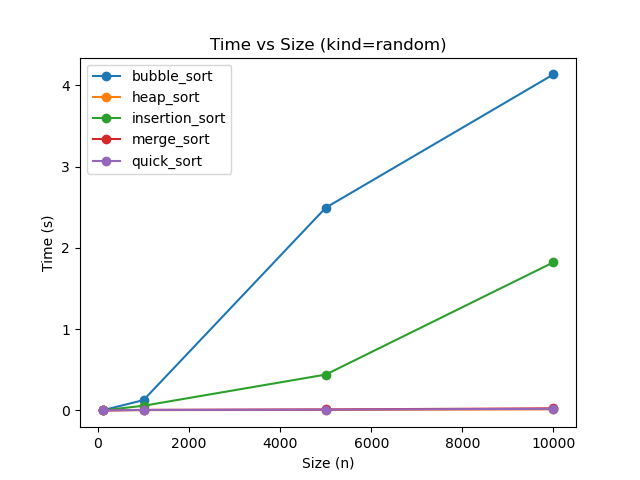
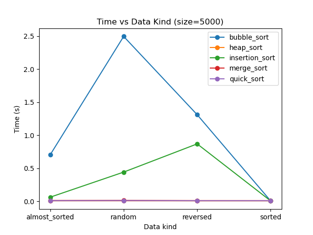

# Лабораторная работа № 4
# Алгоритмы сортировки

**Дата:** 23.09.2025
**Семестр:** 3 курс 1 полугодие - 5 семестр
**Группа:** ПИЖ-б-о-23-2-1
**Дисциплина:** Анализ сложности алгоритмов
**Студент:** Чекалин Егор Юрьевич

## Характеристики ПК для тестирования
Модель устройства: ASUS TUF Gaming A15
CPU: AMD Ryzen 7 7735HS 3.2 GHz
GPU: Nvidia GeForce RTX 4060 Mobile
RAM: 16 GB  
SSD: 100 GB

## Цель работы
Изучить и реализовать основные алгоритмы сортировки. Провести их теоретический и
практический сравнительный анализ по временной и пространственной сложности. Исследовать
влияние начальной упорядоченности данных на эффективность алгоритмов. Получить навыки
эмпирического анализа производительности алгоритмов.

## Практическая часть

### Выполненные задачи

* [x] **Задача 1:** Реализовать 5 алгоритмов сортировки (Bubble Sort, Insertion Sort, Merge Sort, Quick Sort, Heap Sort).
* [x] **Задача 2:** Провести теоретический анализ времени и памяти каждого алгоритма.
* [x] **Задача 3:** Экспериментально сравнить время выполнения алгоритмов на различных наборах данных.
* [x] **Задача 4:** Проанализировать влияние начальной упорядоченности данных на эффективность сортировок.

---

## Результаты выполнения

### Пример работы программы

```bash
Generating datasets...
Running performance tests (this may take a while for large sizes)...
Testing size=100, kind=random ...
  bubble_sort: 0.001255s (avg over 3)
  insertion_sort: 0.000745s (avg over 3)
  merge_sort: 0.000626s (avg over 3)
  quick_sort: 0.000538s (avg over 3)
  heap_sort: 0.000411s (avg over 3)
Testing size=100, kind=sorted ...
  bubble_sort: 0.000337s (avg over 3)
  insertion_sort: 0.000338s (avg over 3)
  merge_sort: 0.000663s (avg over 3)
  quick_sort: 0.000421s (avg over 3)
  heap_sort: 0.000374s (avg over 3)
Testing size=100, kind=reversed ...
  bubble_sort: 0.001477s (avg over 3)
  insertion_sort: 0.001351s (avg over 3)
  merge_sort: 0.000591s (avg over 3)
  quick_sort: 0.000427s (avg over 3)
  heap_sort: 0.000205s (avg over 3)
Testing size=100, kind=almost_sorted ...
  bubble_sort: 0.000586s (avg over 3)
  insertion_sort: 0.000414s (avg over 3)
  merge_sort: 0.000782s (avg over 3)
  quick_sort: 0.000418s (avg over 3)
  heap_sort: 0.000382s (avg over 3)
...
Saved summary table to results/summary.csv
Saved results/time_vs_size_random.png
Saved results/time_vs_kind_n5000.png
Done. Results directory: /home/renoir/ChekalinEU/lab4/results
```

---

## Сводная таблица результатов (фрагмент)

| Алгоритм       | Размер | Тип данных | Среднее время (с) |
| -------------- | ------ | ---------- | ----------------- |
| bubble_sort    | 100    | random     | 0.001255          |
| insertion_sort | 100    | random     | 0.000745          |
| merge_sort     | 100    | random     | 0.000626          |
| quick_sort     | 100    | random     | 0.000538          |
| heap_sort      | 100    | random     | 0.000411          |
| bubble_sort    | 1000   | random     | 0.122954          |
| insertion_sort | 1000   | random     | 0.057083          |
| merge_sort     | 1000   | random     | 0.006910          |
| quick_sort     | 1000   | random     | 0.005804          |
| heap_sort      | 1000   | random     | 0.003959          |

*(Полная таблица содержится в `results/summary.csv`)*

---

## Графики

### Зависимость времени выполнения от размера массива (тип данных — random)



---

### Зависимость времени выполнения от типа данных (n = 5000)



---

## Выводы

1. Алгоритмы с квадратичной сложностью (Bubble Sort, Insertion Sort) резко теряют эффективность при увеличении размера входных данных.
2. Merge Sort, Quick Sort и Heap Sort демонстрируют значительно более высокую производительность благодаря асимптотике `O(n log n)`.
3. На почти отсортированных данных лучше всего работают Insertion Sort и Bubble Sort (с оптимизацией), что соответствует теоретическим ожиданиям.

---

## Ответы на контрольные вопросы

### 1. Какие алгоритмы сортировки имеют сложность O(n²) в худшем случае, а какие — O(n log n)?

К алгоритмам с худшей сложностью O(n²) относятся пузырьковая сортировка, сортировка вставками и быстрая сортировка при неудачном выборе опорного элемента. Алгоритмы, которые работают за O(n log n), включают сортировку слиянием, пирамидальную сортировку и быструю сортировку при среднем и удачном выборе опорного элемента.

### 2. Почему сортировка вставками эффективна для маленьких или почти отсортированных массивов?

Сортировка вставками быстро обрабатывает данные, которые уже почти находятся в правильном порядке, поскольку делает минимальное количество операций. В таких условиях её работа близка к линейной, поэтому она особенно эффективна на небольших и почти упорядоченных массивах.

### 3. В чем разница между устойчивой (stable) и неустойчивой сортировкой?

Устойчивая сортировка сохраняет первоначальный порядок элементов, которые имеют одинаковое значение, тогда как неустойчивая может этот порядок нарушать. Такое свойство важно, когда элементы содержат дополнительные данные помимо ключа.

### 4. Опишите принцип работы быстрой сортировки. Что такое опорный элемент и как его выбор влияет на производительность?

Быстрая сортировка делит массив на части относительно выбранного опорного элемента: одни элементы оказываются меньше него, другие — больше, после чего каждая часть сортируется рекурсивно. Производительность зависит от того, насколько удачно выбран опорный элемент: если он хорошо делит массив на равные части, алгоритм работает эффективно, если же деление получается сильно неравномерным, скорость значительно падает.

### 5. Сортировка слиянием (Merge Sort) гарантирует время O(n log n), но требует дополнительной памяти. В каких ситуациях она предпочтительнее Quick Sort?

Сортировка слиянием подходит тогда, когда важно гарантированное время выполнения вне зависимости от входных данных, когда требуется стабильность обработки элементов, а также при работе с большими объёмами данных, особенно если используется внешняя память, где последовательный доступ предпочтительнее случайного.

---
