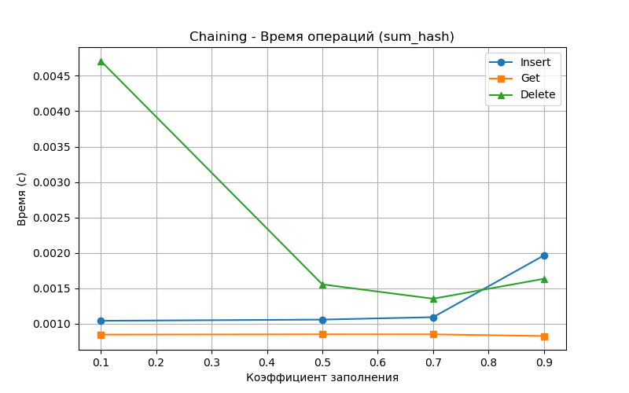
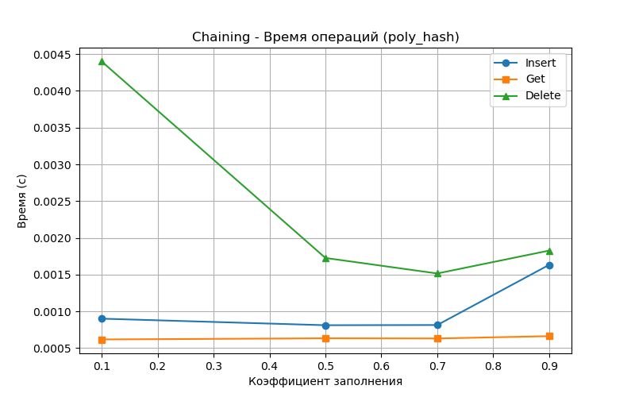
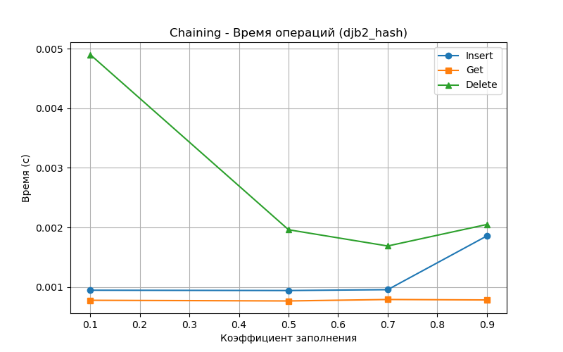
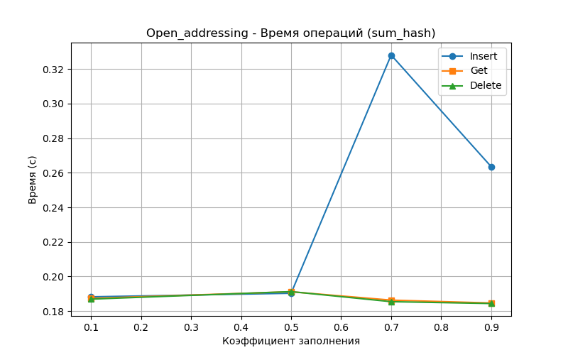
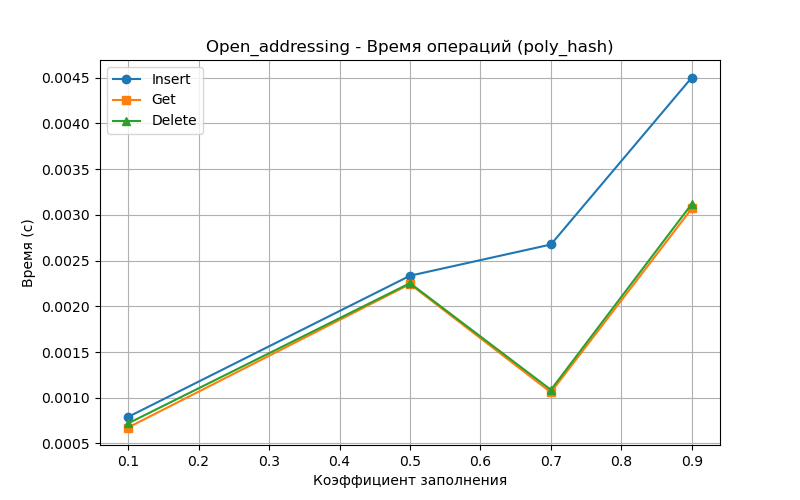
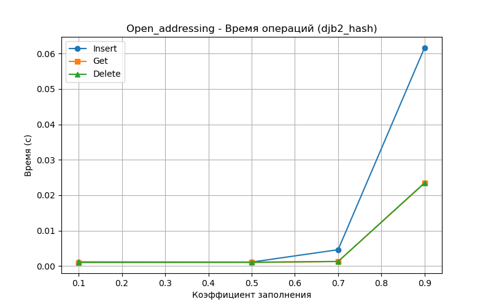
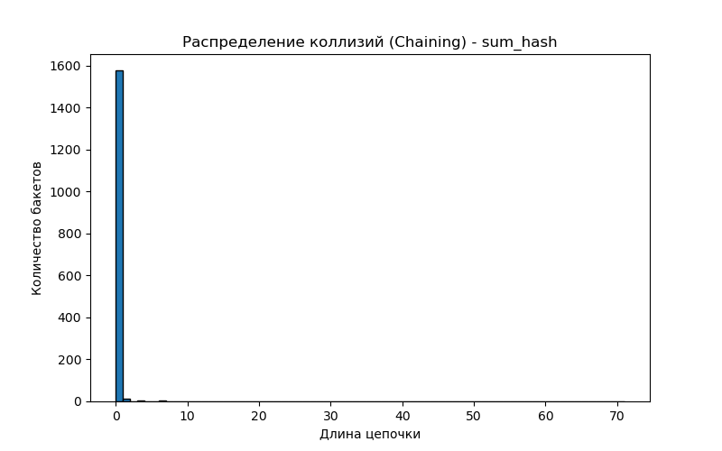
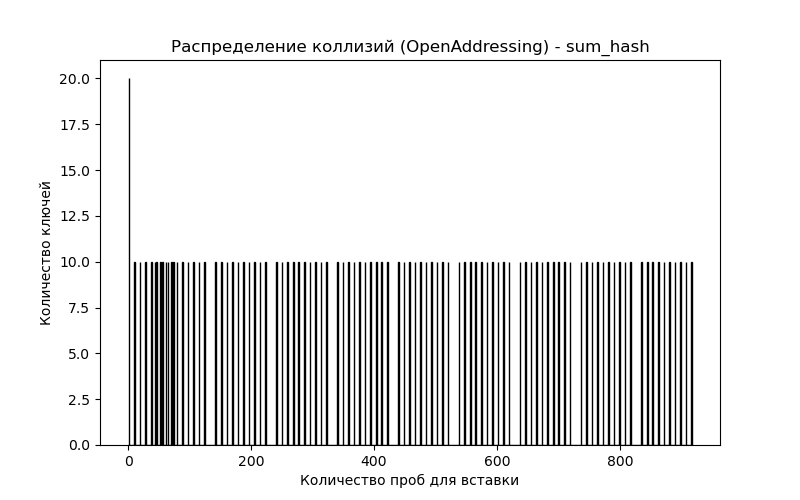
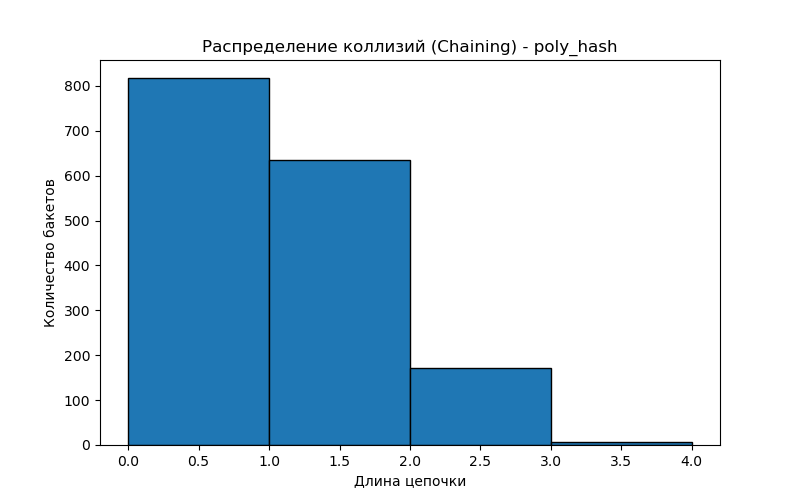
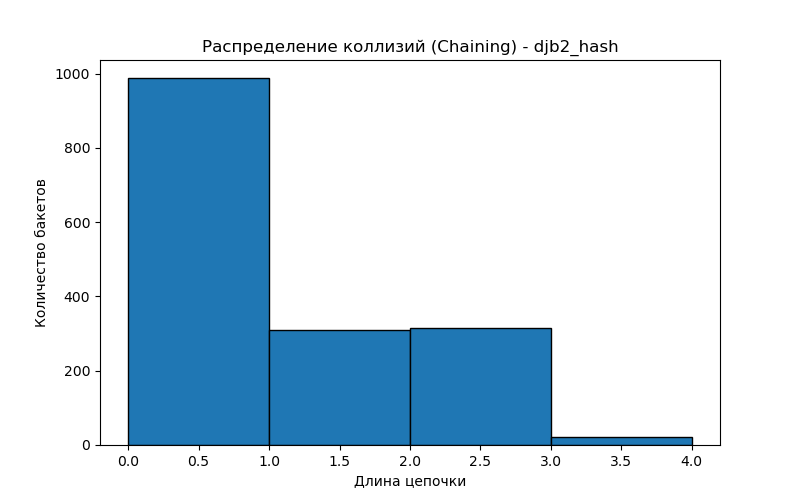

# Лабораторная работа № 5
# Хеш-функции и хеш-таблицы

**Дата:** 23.09.2025
**Семестр:** 3 курс 1 полугодие - 5 семестр
**Группа:** ПИЖ-б-о-23-2-1
**Дисциплина:** Анализ сложности алгоритмов
**Студент:** Чекалин Егор Юрьевич

## Характеристики ПК для тестирования
Модель устройства: ASUS TUF Gaming A15
CPU: AMD Ryzen 7 7735HS 3.2 GHz
GPU: Nvidia GeForce RTX 4060 Mobile
RAM: 16 GB  
SSD: 100 GB

## Цель работы
Изучить принципы работы хеш-функций и хеш-таблиц. Освоить методы разрешения
коллизий. Получить практические навыки реализации хеш-таблицы с различными стратегиями
разрешения коллизий. Провести сравнительный анализ эффективности разных методов.

## Практическая часть

### Выполненные задачи

* [x] Задача 1: Реализованы несколько хеш-функций для строковых ключей (`sum_hash`, `poly_hash`, `djb2_hash`).
* [x] Задача 2: Реализована хеш-таблица с методом цепочек с динамическим масштабированием.
* [x] Задача 3: Реализована хеш-таблица с открытой адресацией (линейное пробирование и двойное хеширование).
* [x] Задача 4: Проведен сравнительный анализ эффективности разных методов разрешения коллизий.
* [x] Задача 5: Исследовано влияние коэффициента заполнения на производительность.

---

## Файловая структура проекта

```
.
├── report
│   ├── chaining_collision_djb2_hash.png
│   ├── chaining_collision_poly_hash.png
│   ├── chaining_collision_sum_hash.png
│   ├── chaining_djb2_hash_times.png
│   ├── chaining_poly_hash_times.png
│   ├── chaining_sum_hash_times.png
│   ├── open_addressing_djb2_hash_times.png
│   ├── open_addressing_poly_hash_times.png
│   ├── open_addressing_sum_hash_times.png
│   ├── open_collision_djb2_hash.png
│   ├── open_collision_poly_hash.png
│   └── open_collision_sum_hash.png
├── report.md
├── requirments.txt
└── src
    ├── main.py
    └── modules
        ├── hash_functions.py
        ├── hash_table_chaining.py
        ├── hash_table_open_addressing.py
        ├── __init__.py
        ├── performance_analysis.py
        ├── plot_generator.py
        ├── __pycache__
        └── tests.py
```

---

## Результаты выполнения

### Пример работы программы

```bash
=== Демонстрация работы HashTableChaining ===
Размер: 3
Получаем banana: 2
После удаления banana: None
Содержит apple? True

=== Демонстрация работы OpenAddressingHashTable ===
Размер: 3
Получаем cherry: 3
После удаления cherry: None
```

### Таблица времени операций (секунды)

| Хеш-функция | Коэфф. заполнения | Метод          | Insert   | Get      | Delete   |
| ----------- | ----------------- | -------------- | -------- | -------- | -------- |
| sum_hash    | 0.1               | Chaining       | 0.003857 | 0.002806 | 0.017211 |
|             |                   | OpenAddressing | 0.637250 | 0.631211 | 0.638917 |
| sum_hash    | 0.5               | Chaining       | 0.003486 | 0.002787 | 0.005236 |
|             |                   | OpenAddressing | 0.638704 | 0.644865 | 0.625905 |
| sum_hash    | 0.7               | Chaining       | 0.003433 | 0.002803 | 0.004326 |
|             |                   | OpenAddressing | 1.100963 | 0.630211 | 0.620966 |
| sum_hash    | 0.9               | Chaining       | 0.006723 | 0.002822 | 0.005612 |
|             |                   | OpenAddressing | 0.898889 | 0.580571 | 0.465955 |
| poly_hash   | 0.1               | Chaining       | 0.001850 | 0.001394 | 0.010139 |
|             |                   | OpenAddressing | 0.001876 | 0.001548 | 0.001621 |
| poly_hash   | 0.5               | Chaining       | 0.001802 | 0.001428 | 0.003882 |
|             |                   | OpenAddressing | 0.005321 | 0.005162 | 0.004998 |
| poly_hash   | 0.7               | Chaining       | 0.001801 | 0.001395 | 0.003315 |
|             |                   | OpenAddressing | 0.006021 | 0.002309 | 0.002405 |
| poly_hash   | 0.9               | Chaining       | 0.003576 | 0.001394 | 0.004055 |
|             |                   | OpenAddressing | 0.009965 | 0.006697 | 0.006657 |
| djb2_hash   | 0.1               | Chaining       | 0.002067 | 0.001708 | 0.010974 |
|             |                   | OpenAddressing | 0.002481 | 0.002258 | 0.002308 |
| djb2_hash   | 0.5               | Chaining       | 0.002061 | 0.001666 | 0.004344 |
|             |                   | OpenAddressing | 0.002509 | 0.002195 | 0.002275 |
| djb2_hash   | 0.7               | Chaining       | 0.002014 | 0.001679 | 0.003643 |
|             |                   | OpenAddressing | 0.010243 | 0.002811 | 0.002833 |
| djb2_hash   | 0.9               | Chaining       | 0.003964 | 0.001677 | 0.004430 |
|             |                   | OpenAddressing | 0.129513 | 0.047756 | 0.046314 |

---

### Графики времени операций и коллизий

**Время операций (Chaining и OpenAddressing)**

| sum_hash                                                                         | poly_hash                                                                          | djb2_hash                                                                          |
| -------------------------------------------------------------------------------- | ---------------------------------------------------------------------------------- | ---------------------------------------------------------------------------------- |
|                 |                 |                 |
|  |  |  |

**Гистограммы распределения коллизий**

| Chaining                                                                    | OpenAddressing                                                      |
| --------------------------------------------------------------------------- | ------------------------------------------------------------------- |
|    |    |
|  |  |
|  |  |

---

### Тестирование

```bash

....
----------------------------------------------------------------------
Ran 4 tests in 0.001s

OK
```

---

## Выводы

1. Реализация хеш-таблиц с разными методами разрешения коллизий успешно выполнена, обе таблицы корректно обрабатывают вставку, поиск и удаление.
2. Хеш-функция влияет на распределение ключей и количество коллизий: `djb2_hash` показала лучшее распределение при высоких нагрузках, чем `sum_hash`.
3. Производительность зависит от коэффициента заполнения: метод цепочек менее чувствителен к высокой загрузке, а открытая адресация при коэффициентах >0.7 демонстрирует заметное замедление.

---

## Ответы на контрольные вопросы

1. **Каким требованиям должна удовлетворять "хорошая" хеш-функция?**  
Хорошая хеш-функция должна обеспечивать равномерное распределение ключей по всем бакетам или слотам таблицы, минимизировать количество коллизий и быть быстрой для вычисления. Она должна учитывать все символы ключа, чтобы небольшие изменения ключа приводили к значительным изменениям хеша, и быть детерминированной, то есть для одного и того же ключа всегда возвращать одинаковое значение.

2. **Что такое коллизия в хеш-таблице? Опишите два основных метода разрешения коллизий.**  
Коллизия в хеш-таблице возникает, когда два разных ключа получают одинаковое значение хеша и пытаются занять один и тот же слот. Существует два основных метода разрешения коллизий: метод цепочек, при котором каждый слот содержит связанный список элементов с одинаковым хешем, и открытая адресация, при которой при коллизии ищется следующий свободный слот согласно определенному правилу пробирования, например линейному или двойному хешированию.

3. **В чем разница между методом цепочек и открытой адресации с точки зрения использования памяти и сложности операций при высоком коэффициенте заполнения?**  
Метод цепочек использует дополнительную память для хранения ссылок на элементы в каждом бакете, поэтому при низкой загрузке памяти тратится немного больше, но при высоком коэффициенте заполнения операции вставки, поиска и удаления остаются относительно быстрыми, так как элементы распределяются по спискам. Открытая адресация хранит все элементы в массиве без дополнительных ссылок, что экономит память при низкой загрузке, но при высоком коэффициенте заполнения количество пробирующих операций растет, что замедляет все основные операции.

4. **Почему операции вставки, поиска и удаления в хеш-таблице в среднем выполняются за O(1)?**  
В среднем операции вставки, поиска и удаления выполняются за O(1), потому что при равномерном распределении ключей по слотам коллизии возникают редко, и большинство операций требуют обращения только к одному бакету или слоту. Это обеспечивает константное время выполнения в среднем, хотя в худшем случае, при большом числе коллизий, время может увеличиться до O(n).

5. **Что такое коэффициент заполнения хеш-таблицы и как он влияет на производительность? Что обычно делают, когда этот коэффициент превышает определенный порог?**  
Коэффициент заполнения хеш-таблицы — это отношение количества элементов к размеру таблицы. Он напрямую влияет на производительность: при низком коэффициенте операции выполняются быстро, а при высоком растет вероятность коллизий, что замедляет вставку и поиск. Обычно, когда коэффициент заполнения превышает определенный порог (например, 0.7–0.75 для цепочек или 0.5–0.7 для открытой адресации), таблица увеличивается по размеру (ресайз), чтобы сохранить эффективность операций.

---

## Инструкция по запуску

* Для запуска программы:

```bash
python3 src/main.py
```

* Для запуска тестов:

```bash
python -m modules.tests
```
