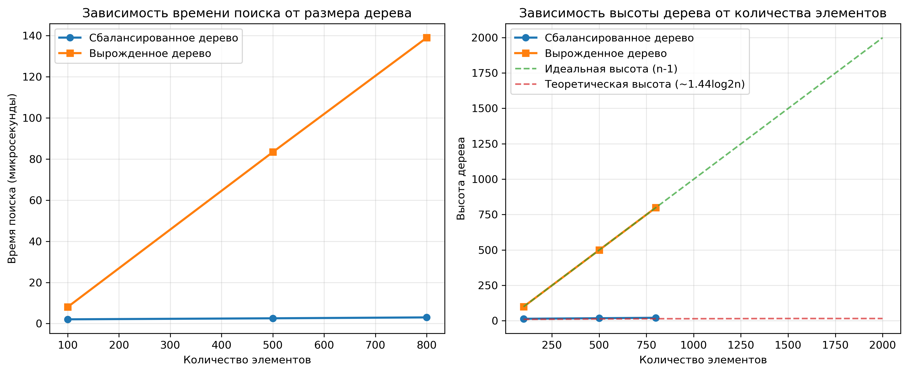

# Лабораторная работа № 6
# Деревья. Бинарные деревья поиска

**Дата:** 23.09.2025
**Семестр:** 3 курс 1 полугодие - 5 семестр
**Группа:** ПИЖ-б-о-23-2-1
**Дисциплина:** Анализ сложности алгоритмов
**Студент:** Чекалин Егор Юрьевич

## Характеристики ПК для тестирования
Модель устройства: ASUS TUF Gaming A15
CPU: AMD Ryzen 7 7735HS 3.2 GHz
GPU: Nvidia GeForce RTX 4060 Mobile
RAM: 16 GB  
SSD: 100 GB

## Цель работы
Изучить древовидные структуры данных, их свойства и применение. Освоить основные
операции с бинарными деревьями поиска (BST). Получить практические навыки реализации BST на
основе узлов (pointer-based), рекурсивных алгоритмов обхода и анализа их эффективности.
Исследовать влияние сбалансированности дерева на производительность операций.

## Практическая часть

### Выполненные задачи

* [x] **Задача 1:** Реализовать бинарное дерево поиска (BST) на основе узлов с основными операциями: вставка, поиск, удаление, вычисление свойств.
* [x] **Задача 2:** Реализовать рекурсивные и итеративные методы обхода дерева: *in-order*, *pre-order*, *post-order*, *level-order*.
* [x] **Задача 3:** Реализовать дополнительные методы анализа дерева: высота, размер, проверка корректности BST.
* [x] **Задача 4:** Провести анализ сложности операций для сбалансированного и вырожденного деревьев.
* [x] **Задача 5:** Визуализировать структуру дерева и построить график производительности.

---

## Результаты выполнения

### Пример работы программы

```bash
=== ДЕМОНСТРАЦИЯ BST ===

Вставляем значения: [55, 28, 72, 18, 33, 63, 88, 12, 24, 37, 47]

Дерево:
│       ┌── 88
│   ┌── 72
│   │   └── 63
└── 55
    │           ┌── 47
    │       ┌── 37
    │   ┌── 33
    └── 28
        │   ┌── 24
        └── 18
            └── 12

Размер дерева: 11
Высота дерева: 4
Минимальное значение: 12
Максимальное значение: 88
Является корректным BST: True

Рекурсивный in-order обход: [12, 18, 24, 28, 33, 37, 47, 55, 63, 72, 88]
Итеративный in-order обход: [12, 18, 24, 28, 33, 37, 47, 55, 63, 72, 88]
Pre-order обход: [55, 28, 18, 12, 24, 33, 37, 47, 72, 63, 88]
Post-order обход: [12, 24, 18, 47, 37, 33, 28, 63, 88, 72, 55]
Level-order обход: [55, 28, 72, 18, 33, 63, 88, 12, 24, 37, 47]
Значение 37 найдено
Значение 58 не найдено
Значение 18 найдено

Удаляем значение 18
Значение удалено
In-order после удаления: [12, 24, 28, 33, 37, 47, 55, 63, 72, 88]
BST корректно: True
Размер дерева после удаления: 10

Удаляем значение 28
Значение удалено
In-order после удаления: [12, 24, 33, 37, 47, 55, 63, 72, 88]
BST корректно: True
Размер дерева после удаления: 9

Удаляем значение 55
Значение удалено
In-order после удаления: [12, 24, 33, 37, 47, 63, 72, 88]
BST корректно: True
Размер дерева после удаления: 8


=== СРАВНЕНИЕ ДЕРЕВЬЕВ ===

Сбалансированное дерево (случайные значения):
│   ┌── 40
└── 36
    │           ┌── 35
    │       ┌── 32
    │       │   └── 29
    │       │       └── 26
    │       │           └── 21
    │   ┌── 18
    │   │   └── 17
    └── 16
        │       ┌── 11
        │   ┌── 10
        └── 9
            └── 4
                └── 2

Высота: 6
Размер: 15

Вырожденное дерево (отсортированные значения):
│                                                       ┌── 14
│                                                   ┌── 13
│                                               ┌── 12
│                                           ┌── 11
│                                       ┌── 10
│                                   ┌── 9
│                               ┌── 8
│                           ┌── 7
│                       ┌── 6
│                   ┌── 5
│               ┌── 4
│           ┌── 3
│       ┌── 2
│   ┌── 1
└── 0

Высота: 14
Размер: 15
```

---

### Анализ производительности

Текущий лимит рекурсии: **1000**

| Размер | Баланс. время (мкс) | Вырожд. время (мкс) | Баланс. высота | Вырожд. высота |
| ------ | ------------------- | ------------------- | -------------- | -------------- |
| 100    | 2.07                | 8.07                | 14             | 99             |
| 500    | 2.57                | 83.39               | 18             | 499            |
| 800    | 3.00                | 138.99              | 21             | 799            |
| 1000   | —                   | —                   | —              | —              |
| 1500   | —                   | —                   | —              | —              |
| 2000   | —                   | —                   | —              | —              |

*(Размеры 1000+ пропущены из-за ошибки: «maximum recursion depth exceeded»)*

### График производительности



---

### Тестирование

```bash
.......
----------------------------------------------------------------------
Ran 7 tests in 0.001s

OK
```

---

## Выводы

1. Реализовано корректное бинарное дерево поиска с поддержкой всех основных операций.
2. Проведён сравнительный анализ работы BST в сбалансированном и вырожденном виде.
3. Эксперименты подтвердили теоретические различия сложности: вырожденное дерево деградирует до O(n).

---

## Ответы на контрольные вопросы

1. **Сформулируйте основное свойство BST.**
Основное свойство бинарного дерева поиска (BST) заключается в том, что для любого узла дерева все элементы в его левом поддереве имеют значения меньшие, чем значение самого узла, а все элементы в правом поддереве — большие. Благодаря этому свойству дерево может эффективно выполнять операции поиска, вставки и удаления, используя упорядоченность данных.

2. **Опишите алгоритм вставки. Сложность?**
Алгоритм вставки элемента в BST работает следующим образом: начиная с корня, программа сравнивает вставляемое значение с текущим узлом. Если значение меньше — переход осуществляется в левое поддерево, если больше — в правое. Этот процесс продолжается до тех пор, пока не будет найден подходящий пустой узел, куда элемент можно вставить. Эффективность вставки зависит от структуры дерева: в сбалансированном BST высота логарифмическая, поэтому вставка занимает O(log n), а в вырожденном (который превращается в обычный связный список) высота составляет n, и вставка выполняется за O(n).

3. **Чем отличается DFS от BFS? Виды DFS?**
Главное различие между обходом в глубину (DFS) и обходом в ширину (BFS) состоит в стратегии просмотра узлов. DFS сначала углубляется по одной ветви дерева до самого листа, а затем возвращается назад; BFS же проходит дерево по уровням, начиная от корня и последовательно обрабатывая все узлы одного уровня перед переходом на следующий. К обходам DFS относятся три основных вида: in-order (слева → узел → справа), pre-order (узел → слева → справа) и post-order (слева → справа → узел). Каждый из них используется для различных задач, например, in-order даёт отсортированную последовательность для BST.

4. **Почему сложность операций в вырожденном BST становится O(n)?**
Сложность операций в вырожденном BST становится O(n) потому, что дерево теряет свою разветвлённую структуру и превращается в линейную последовательность узлов. В такой ситуации каждая операция поиска или вставки требует пройти практически через все элементы — от корня до самого последнего узла, что приводит к линейному времени выполнения.

5. **Что такое сбалансированное дерево и как оно решает проблему вырождения?**
Сбалансированное дерево — это структура данных, которая автоматически поддерживает высоту дерева близкой к минимально возможной, то есть порядка O(log n). Примером таких структур являются AVL-деревья и красно-чёрные деревья. Они отслеживают степень дисбаланса после каждой операции вставки или удаления и при необходимости выполняют специальные повороты и перестройку части дерева. Это предотвращает вырождение дерева в линейную цепочку и обеспечивает стабильную эффективность операций.

---

## Инструкция по запуску

Перейдите в директорию `src`:

```bash
cd src
```

### Запуск программы

```bash
python3 main.py
```

### Запуск тестов

```bash
python3 -m modules.tests
```

### Запуск анализа времени работы BST

```bash
python3 -m modules.analysis
```

---

## Структура проекта

```
.
├── __pycache__
│   ├── analysis.cpython-313.pyc
│   ├── binary_search_tree.cpython-313.pyc
│   └── tree_traversal.cpython-313.pyc
├── report
│   └── bst_performance_analysis.png
├── report.md
└── src
    ├── main.py
    └── modules
        ├── analysis.py
        ├── binary_search_tree.py
        ├── __init__.py
        ├── __pycache__
        ├── tests.py
        └── tree_traversal.py
```
