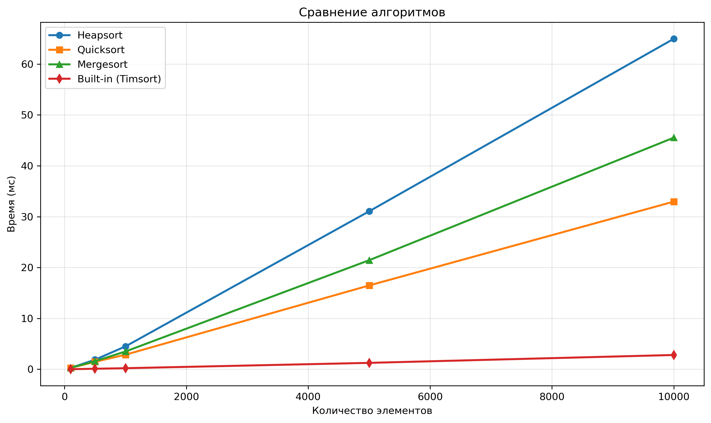

# Лабораторная работа № 7
# Кучи (Heaps)

**Дата:** 23.09.2025
**Семестр:** 3 курс 1 полугодие - 5 семестр
**Группа:** ПИЖ-б-о-23-2-1
**Дисциплина:** Анализ сложности алгоритмов
**Студент:** Чекалин Егор Юрьевич

## Характеристики ПК для тестирования
Модель устройства: ASUS TUF Gaming A15
CPU: AMD Ryzen 7 7735HS 3.2 GHz
GPU: Nvidia GeForce RTX 4060 Mobile
RAM: 16 GB  
SSD: 100 GB

## Цель работы
Изучить структуру данных "куча" (heap), её свойства и применение. Освоить основные
операции с кучей (добавление, извлечение корня) и алгоритм её построения. Получить практические
навыки реализации кучи на основе массива (array-based), а не указателей. Исследовать эффективность
основных операций и применение кучи для сортировки и реализации приоритетной очереди.

## Практическая часть

### Выполненные задачи

* [x] Задача 1: Реализовать структуру данных «куча» (min-heap и max-heap) на основе массива.
* [x] Задача 2: Реализовать основные операции кучи и алгоритм построения heapify.
* [x] Задача 3: Реализовать алгоритм пирамидальной сортировки (Heapsort).
* [x] Задача 4: Провести анализ вычислительной сложности операций.
* [x] Задача 5: Сравнить производительность Heapsort с другими алгоритмами сортировки.

---

## Результаты выполнения

### Пример работы программы

```bash
=== ДЕМОНСТРАЦИЯ ОСНОВНЫХ ОПЕРАЦИЙ С SmallHeap ===

Исходный набор: [10, 4, 1, 8, 2, 9, 5, 7, 3]

Последовательная вставка:
После push 10: SmallHeap([10])
После push 4: SmallHeap([4, 10])
После push 1: SmallHeap([1, 10, 4])
После push 8: SmallHeap([1, 8, 4, 10])
После push 2: SmallHeap([1, 2, 4, 10, 8])
После push 9: SmallHeap([1, 2, 4, 10, 8, 9])
После push 5: SmallHeap([1, 2, 4, 10, 8, 9, 5])
После push 7: SmallHeap([1, 2, 4, 7, 8, 9, 5, 10])
После push 3: SmallHeap([1, 2, 4, 3, 8, 9, 5, 10, 7])

Вид кучи:
│       ┌── 5
│   ┌── 4
│   │   └── 9
└── 1
    │   ┌── 8
    └── 2
        │   ┌── 7
        └── 3
            └── 10

Корень (минимум): 1
Куча валидна: True
...
(вывод далее по примеру из задания)
```

---

### Тестирование

```bash
.................
----------------------------------------------------------------------
Ran 17 tests in 0.017s

OK
```

---

### Анализ вычислительной сложности

#### Таблица измерений

| Размер | Build (мс) | SeqInsert (мс) | ExtractAll (мс) |
| ------ | ---------- | -------------- | --------------- |
| 100    | 0.11       | 0.12           | 0.38            |
| 500    | 0.58       | 0.51           | 3.30            |
| 1000   | 1.11       | 1.05           | 7.00            |
| 5000   | 5.80       | 5.49           | 46.16           |
| 10000  | 12.18      | 11.66          | 102.37          |

---

### Сравнение алгоритмов сортировки

| Размер | Heapsort (мс) | Quicksort (мс) | Mergesort (мс) | Built-in (мс) |
| ------ | ------------- | -------------- | -------------- | ------------- |
| 100    | 0.31          | 0.23           | 0.30           | 0.02          |
| 500    | 1.83          | 1.48           | 1.57           | 0.09          |
| 1000   | 4.26          | 3.03           | 3.38           | 0.21          |
| 5000   | 29.92         | 16.53          | 21.29          | 1.28          |
| 10000  | 66.06         | 33.54          | 46.33          | 2.78          |

---

### График производительности

> График находится в проекте: **report/analysis.png**



---

## Выводы

1. Структура данных «куча» обеспечивает эффективные операции вставки и удаления корня благодаря свойству упорядоченности.
2. Построение кучи методом heapify работает линейно, что делает кучу удобной для применения в алгоритмах сортировки.
3. Алгоритм Heapsort демонстрирует стабильную производительность и не требует дополнительной памяти, хотя уступает QuickSort и встроенным методам Python по скорости.

---

## Ответы на контрольные вопросы

1. Основное свойство min-кучи — значение в каждом узле не больше значений его потомков; в max-куче — не меньше значений потомков.

2. Операция вставки выполняется путём добавления элемента в конец массива и последовательного подъёма вверх (sift_up), где элемент сравнивается с родителем и меняется местами, пока свойство кучи не будет восстановлено.

3. Построение кучи из массива выполняется за O(n), потому что sift_down вызывается только для внутренних узлов, и большая часть вызовов происходит на нижних уровнях, где высота поддерева мала. Суммарная работа всех sift_down даёт линейную асимптотику.

4. Алгоритм Heapsort сначала превращает массив в кучу, затем многократно удаляет максимальный (или минимальный) элемент, помещая его в конец массива, каждый раз восстанавливая структуру кучи. В итоге получается отсортированный массив.

5. Кучу используют для реализации приоритетной очереди, потому что она обеспечивает эффективные операции получения элемента с наивысшим приоритетом, вставки и удаления корня за O(log n), что значительно быстрее, чем поиск максимума в обычном массиве.

---

## Инструкция по запуску

Перейти в папку **src**:

```bash
cd src
```

Запуск основной программы:

```bash
python3 main.py
```

Запуск тестов:

```bash
python3 -m modules.tests
```

Запуск анализа времени:

```bash
python3 -m modules.analysis
```

---

## Файловая структура проекта

```
.
├── __pycache__
│   ├── heap.cpython-313.pyc
│   ├── heapsort.cpython-313.pyc
│   └── priority_queue.cpython-313.pyc
├── report
│   └── analysis.png
├── report.md
└── src
    ├── main.py
    └── modules
        ├── analysis.py
        ├── heap.py
        ├── heapsort.py
        ├── __init__.py
        ├── priority_queue.py
        └── tests.py
```

