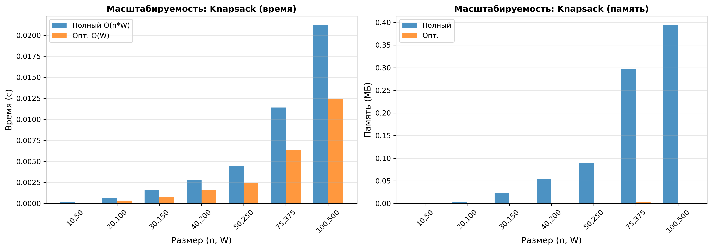
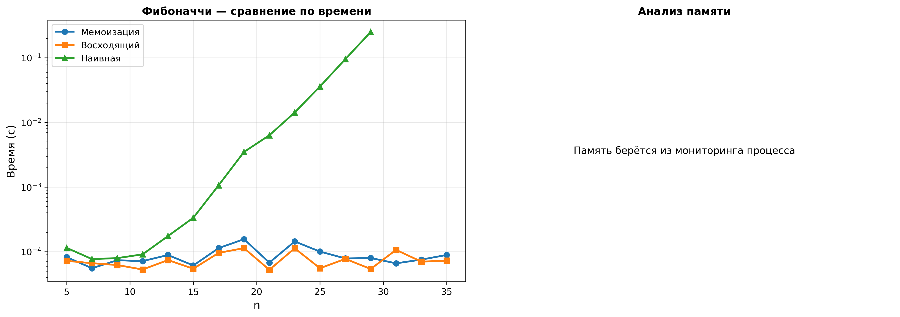

# Отчёт по лабораторной работе 09
## Динамическое программирование

**Дата:** 05.12.2025
**Семестр:** 3 курс 1 полугодие - 5 семестр
**Группа:** ПИЖ-б-о-23-2-1
**Дисциплина:** Анализ сложности алгоритмов
**Студент:** Чекалин Егор Юрьевич

## Характеристики ПК для тестирования
Модель устройства: ASUS TUF Gaming A15
CPU: AMD Ryzen 7 7735HS 3.2 GHz
GPU: Nvidia GeForce RTX 4060 Mobile
RAM: 16 GB
SSD: 100 GB

## Цель работы

Изучить метод динамического программирования (ДП) как мощный инструмент для решения сложных задач путём их разбиения на перекрывающиеся подзадачи. Освоить два основных подхода к реализации ДП: нисходящий (с мемоизацией) и восходящий (с заполнением таблицы). Получить практические навыки выявления оптимальной подструктуры задач, построения таблиц ДП и анализа временной и пространственной сложности алгоритмов.

## Практическая часть

### Выполненные задачи

* [x] Задача 1: Реализовать классические алгоритмы динамического программирования (Фибоначчи, LCS, Levenshtein, LIS, размен монет, Knapsack 0-1)
* [x] Задача 2: Реализовать оба подхода (нисходящий с мемоизацией и восходящий с заполнением таблиц)
* [x] Задача 3: Провести сравнительный анализ эффективности методов (время и память)
* [x] Задача 4: Проанализировать асимптотики алгоритмов и оптимизации (O(n²), O(n log n), оптимизация памяти)
* [x] Задача 5: Решить практические задачи с применением ДП и построить DP-таблицы

---

## Результаты выполнения

### Пример работы программы

```bash
======================================================================
ДИНАМИЧЕСКОЕ ПРОГРАММИРОВАНИЕ — ДЕМОНСТРАЦИИ
======================================================================

======================================================================
ПРИМЕР 1: РЯД ФИБОНАЧЧИ
======================================================================

Вычисляем F(10):
1) Наивная рекурсия: F(10) = 55
2) С кешем:        F(10) = 55
3) Восходящий:     F(10) = 55
4) Память-оптим.:  F(10) = 55

Первые 15 чисел ряда (пример):
[0, 1, 1, 2, 3, 5, 8, 13, 21, 34, 55, 89, 144, 233, 377]

======================================================================
ПРИМЕР 2: KNAPSACK 0-1
======================================================================

Входные данные:
Предметы: [(0, 2, 3), (1, 3, 4), (2, 4, 5), (3, 5, 6)]
Вместимость: 8

Максимальная стоимость: 10

С восстановлением решения:
Макс. стоимость: 10
Выбранные предметы (индексы): [1, 3]
Детали:
  Предмет 1: вес=3, стоимость=4
  Предмет 3: вес=5, стоимость=6
Итого: вес=8, стоимость=10

----------------------------------------------------------------------

Пример 2:
Предметы: [(0, 6, 30), (1, 3, 14), (2, 4, 16), (3, 2, 9)]
Вместимость: 10
Максимальная стоимость: 46
Выбранные предметы: [0, 2]

======================================================================
ПРИМЕР 3: LCS
======================================================================

Строки: 'abcde' и 'ace'
Длина LCS: 3
LCS: 'ace'

Строки: 'AGGTAB' и 'GXTXAYB'
Длина LCS: 4
LCS: 'GTAB'

Строки: 'greetings' и 'growing'
Длина LCS: 5
LCS: 'gring'

======================================================================
ПРИМЕР 4: РАССТОЯНИЕ ЛЕВЕНШТЕЙНА
======================================================================

Преобразуем 'kitten' -> 'sitting':
Расстояние: 3

Преобразуем 'saturday' -> 'sunday':
Расстояние: 3

Преобразуем '' -> 'b':
Расстояние: 1

Преобразуем 'b' -> '':
Расстояние: 1

======================================================================
ПРИМЕР 5: РАЗМЕН МОНЕТ
======================================================================
Номиналы: [1, 2, 5, 10]
Сумма: 17

Мин. количество монет: 3
Используемые монеты: [2, 5, 10]
Проверка: 2 + 5 + 10 = 17

Число способов составить 17:
28 способов

======================================================================
ПРИМЕР 6: LIS
======================================================================

Массив: [11, 9, 2, 5, 3, 7, 101, 18]
Длина LIS: 4
LIS: [2, 5, 7, 101]
Длина (O(n log n)): 4
```

---

## Аналитическая таблица эффективности (Фибоначчи)

| n  | Наивная (s) | Мемоизация (s) | Восходящий (s) | F(n)    |
| -- | ----------- | -------------- | -------------- | ------- |
| 5  | 0.000115    | 0.000082       | 0.000072       | 5       |
| 7  | 0.000077    | 0.000056       | 0.000066       | 13      |
| 9  | 0.000080    | 0.000074       | 0.000062       | 34      |
| 11 | 0.000091    | 0.000072       | 0.000053       | 89      |
| 13 | 0.000175    | 0.000089       | 0.000074       | 233     |
| 15 | 0.000335    | 0.000061       | 0.000055       | 610     |
| 17 | 0.001068    | 0.000114       | 0.000096       | 1597    |
| 19 | 0.003493    | 0.000156       | 0.000114       | 4181    |
| 21 | 0.006330    | 0.000068       | 0.000052       | 10946   |
| 23 | 0.014241    | 0.000144       | 0.000113       | 28657   |
| 25 | 0.036052    | 0.000100       | 0.000055       | 75025   |
| 27 | 0.095370    | 0.000079       | 0.000078       | 196418  |
| 29 | 0.250732    | 0.000080       | 0.000054       | 514229  |
| 31 | –           | 0.000066       | 0.000107       | 1346269 |
| 33 | –           | 0.000076       | 0.000070       | 3524578 |
| 35 | –           | 0.000089       | 0.000073       | 9227465 |

---

## Графики

### 📈 Сравнение подходов на примере Фибоначчи



### 📈 Масштабируемость Knapsack 0-1



---

## Тестирование

```bash
test_combinations ... ok
test_impossible ... ok
test_single_coin ... ok
test_with_recovery ... ok
test_zero_amount ... ok
test_base_cases ... ok
test_consistency ... ok
test_known_values ... ok
test_consistency_with_recovery ... ok
test_empty_knapsack ... ok
test_insufficient_capacity ... ok
test_optimized_consistency ... ok
test_single_item ... ok
test_empty_strings ... ok
test_identical_strings ... ok
test_known_cases ... ok
test_no_common_subsequence ... ok
test_consistency ... ok
test_decreasing_sequence ... ok
test_empty_array ... ok
test_increasing_sequence ... ok
test_single_element ... ok
test_consistency ... ok
test_empty_strings ... ok
test_identical_words ... ok
test_single_character_difference ... ok
test_symmetry ... ok

----------------------------------------------------------------------
Ran 27 tests in 0.009s
OK
```

---

## Выводы

1. Динамическое программирование позволяет существенно ускорить вычисления при наличии оптимальной подструктуры и пересекающихся подзадач.
2. Восходящий подход обычно быстрее нисходящего, особенно при больших входных данных.
3. Оптимизация памяти позволяет существенно уменьшить потребление ресурсов без потери точности.

---

## Ответы на контрольные вопросы

1. Два ключевых свойства — наличие оптимальной подструктуры и пересекающихся подзадач.
2. Нисходящий подход использует рекурсию и мемоизацию, вычисляя только необходимые подзадачи; восходящий заполняет таблицу итеративно, решая все подзадачи заранее.
3. В задаче о рюкзаке решение для подмножества предметов и меньшей вместимости используется как часть решения для большего набора, что демонстрирует оптимальную подструктуру.
4. Таблица LCS строится как матрица размеров (len(a)+1)×(len(b)+1); каждая ячейка определяется сравнением символов и максимумом из соседних значений, после чего результат восстанавливается движением назад по таблице.
5. Алгоритмы мемоизации и табличного вычисления устраняют экспоненциальное число повторных вычислений, что снижает сложность до O(n), а матричное возведение переходной матрицы позволяет вычислять n-е число за O(log n).

---

## Инструкция по запуску

```bash
cd src
python3 main.py             # запуск основной программы
python3 -m modules.tests    # запуск тестов
python3 -m modules.analysis # запуск анализа производительности
```

---

## Файловая структура проекта

```
.
├── report
│   ├── fibonacci_comparison.png
│   └── knapsack_scalability.png
├── report.md
└── src
    ├── main.py
    └── modules
        ├── analysis.py
        ├── dynamic_programming.py
        ├── __init__.py
        ├── __pycache__
        └── tests.py
```
